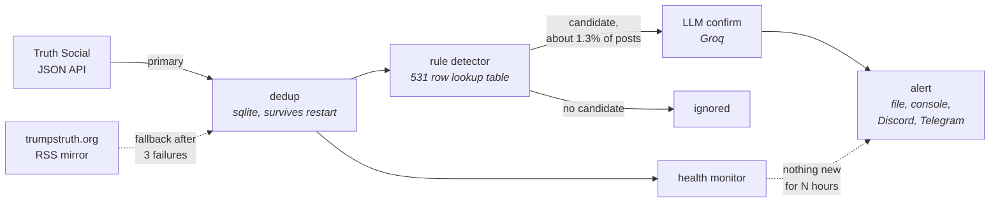

# Truth Social stock-mention alert agent

Monitors the public Truth Social account `@realDonaldTrump` and sends an alert whenever a
post mentions a publicly traded company, by ticker or by name. Runs locally.

## How it works



Both sources return the same Truth Social status ids, so switching between them cannot
re-alert a post that already went out. The LLM only ever sees posts the rules already
flagged, which keeps cost and added latency small.

### Reading the numbers

The write-up reports two scores per detector. **Precision** is how many alerts were real,
**recall** how many real mentions got caught, and **F1** balances the two. The ticker columns
score whether the right company was named, not just whether the post was a mention. **Exact
set** counts how many stock posts got their full ticker list right.

### When something breaks

Every failure below was tested by forcing it, not just handled in principle.

| Failure | What happens |
| --- | --- |
| Primary API blocked or erroring | Each poll retries the primary a few times, then counts one failure. After 3 such polls the circuit breaker opens and the RSS mirror takes over, and the primary is probed again after a cooldown. Both sources return the same status ids, so a switch cannot re-alert |
| Rate limited with `Retry-After` | Honoured inside the retry and again between polls, so the next request waits as long as the server asked |
| Endpoint changes shape | A page more than half unparseable raises rather than returning an empty list, so a silent schema change is loud |
| Polls succeed but nothing arrives | `no_new_posts` heartbeat fires. State is on disk, so a restart cannot reset the clock |
| Groq unavailable | The LLM arm falls back to the rule verdict and the agent keeps alerting |
| Sentiment model fails | The alert goes out without the sentiment line |
| A remote channel down (Discord or Telegram) | The file sink and console still deliver, so the alert is never lost. One alert probes the failing channel, the rest of the poll skips it, and they queue for the next. Delivery is tracked per channel, so one being down cannot hold up another |
| Process dies mid delivery | The alert is re-sent on the next poll. The claim is keyed on post and channel, so a restart cannot repeat what already completed. Delivery is at least once, not exactly once |
| Process dies before detection | The next poll re-checks anything left undetected, so it is still caught |
| A store full of old posts (a restore, an import, a backfill from before the eligibility flag) | Two gates, not one. Backfilled rows are marked ineligible, and on a live source nothing older than `MAX_ALERT_AGE_HOURS` alerts regardless of the flag. Found this the hard way: a database built before the flag existed re-announced six week old news a batch per poll |

## Demo and write-up

- [docs/demo_log.md](docs/demo_log.md) captures three real runs: the offline replay, the
  same command again showing dedup holds, and a live delivery to Telegram with the alert
  records behind it.
- [docs/index.html](docs/index.html) is a short page explaining the system for someone who
  has not read the code.
- The write-up starts at [Write-up](#write-up) below.

## Setup

Requires Python 3.11. The system Python on macOS is 3.9 and will not work.

```bash
uv venv --python 3.11
uv pip install -r requirements.txt
cp .env.example .env      # then fill in the values you want
```

Four channels, in delivery order. **file** appends every alert to `data/alerts.jsonl` and
**console** prints it, both with no setup and no network, so an alert is never lost even when
every remote channel is down. **discord** is the primary remote channel. **telegram** is an
optional second.

Every credential is optional. With none set the agent still runs, writing to the file sink and
the console.

Discord is primary because a webhook URL is the entire credential. A Telegram bot needs a token
plus a chat id you discover by messaging the bot first, and the token is invalidated the moment
you regenerate it in BotFather, which fails in a way that looks exactly like the network being
down. Both of those cost me an afternoon.

Telegram is blocked outright on some networks, including whole countries. If
`setup_telegram.py` reports that it cannot reach the API, that is a blocked port rather than a
bad token, and the console channel needs no network at all. On such a network every poll spends
its Telegram timeout finding out what it already knows, so turn the timeout down
(`REQUEST_TIMEOUT=3`) or leave `TELEGRAM_BOT_TOKEN` unset.

| Variable | Needed for |
| --- | --- |
| `DISCORD_WEBHOOK_URL` | The primary remote channel. Discord server, Server Settings, Integrations, New Webhook, Copy URL. The URL is the whole credential, so treat it like a password |
| `TELEGRAM_BOT_TOKEN`, `TELEGRAM_CHAT_ID` | Optional second remote channel. Token from @BotFather, message your bot once, then `uv run python scripts/setup_telegram.py` fills in the chat id |
| `GROQ_API_KEY` | The LLM detector arm, the labeling helper, and the bonus sentiment line (bullish/bearish/neutral) added to delivered alerts |

## Running

```bash
# Full end to end demo. No network, no credentials, real archive posts that mention companies.
# Use a throwaway database: dedup is permanent, so a second run on the same store is silent,
# which is the point of run 2 below but not what you want the first time you look at it.
DB_PATH=/tmp/demo.db uv run python agent.py run --once --source demo

# Live monitoring
uv run python agent.py run

# Pick a detector. Defaults to combined when GROQ_API_KEY is set, rules otherwise.
uv run python agent.py run --detector rules

# Verify your alert channel in isolation before trusting the agent
uv run python agent.py test-alert

uv run python agent.py health      # heartbeat state and active alarms
uv run python agent.py stats       # store counts
uv run pytest -q                   # full suite, offline, nothing touches the network
```

### Dashboard

```bash
uv run python scripts/dashboard.py --port 8000 --db data/agent.db
```

One page on `http.server`, no new dependency. It shows:

- a status hero (running, stopped or degraded) with live figures and a countdown to the next poll
- start and stop buttons
- poll interval presets, each with a line explaining what that value costs
- a backfill trigger, with a time and page estimate before you run it
- a fetched to alerted pipeline funnel
- a ticker filterable mentions feed
- health and latency, reusing `latency_report.py`'s own maths
- precision, recall and F1 read from `data/eval/metrics.md` when it exists
- an ingestion panel showing which source is live, primary or mirror, with the reason and time of
  the last failover. The agent records this every poll, so the page reflects the process rather
  than guessing
- an alert channel panel: which channels are set up, live, paused, failing or dropping, with per
  channel sent/queued/dropped counts and a pause button. Pausing is written to the store, so the
  running agent picks it up on the next poll without a restart, and anything missed while a
  channel was off goes out when it comes back, bounded by the same age gate live alerts use
- a warning under the poll interval when the chosen value is aggressive enough to raise the odds
  of being blocked, including the case where it is below the hourly cap and so is not the
  interval it claims to be
- the ticker lexicon editor

The page renders once, then a small script polls `GET /api/state` every 10 seconds and updates
in place, so nothing you are mid way through typing gets wiped by a refresh.

`is_running()` checks the recorded pid with `os.kill(pid, 0)` rather than trusting the pid
file, so a stale file left behind by a crash is reported as stopped instead of lying that
the agent is still running. Settings you change (poll interval, backfill window) are saved
to the store and survive a restart of the dashboard itself.

It is local only, binds to 127.0.0.1 by default, and has no authentication, so it must
never be exposed to a network.

### Reproducing the evaluation

```bash
uv run python scripts/backfill.py --days 45 --delay 2.5 --out data/history.jsonl
uv run python scripts/build_eval_set.py --history data/history.jsonl \
    --out data/eval/eval_sample.jsonl --seed 42
uv run python scripts/prelabel.py --in data/eval/eval_sample.jsonl \
    --out data/eval/prelabels.jsonl --model openai/gpt-oss-120b
uv run python scripts/label.py --sample data/eval/eval_sample.jsonl \
    --prelabels data/eval/prelabels.jsonl --out data/eval/labeled.jsonl \
    --blind-count 30 --seed 42
uv run python scripts/evaluate.py
uv run python scripts/latency_report.py
```

Sampling is seeded, so a rebuild is deterministic. The committed sample was frozen before
the lookup table grew to 531 rows, so rebuilding today draws a different candidate stratum.
That is deliberate: the labels belong to the frozen sample, and re-drawing it would throw
them away.

`latency_report.py` reads timings recorded by live polls, so on a fresh clone it has nothing
to report and prints zeros. The numbers in the write-up come from a run against the real
account.

### Docker

```bash
docker build -t tsalert .
docker run --rm tsalert                                  # offline demo, nothing persisted
docker run --rm -v tsalert-data:/data tsalert            # same demo, state kept
docker run --rm --env-file .env -v tsalert-data:/data tsalert run
```

The volume matters: dedup and alert idempotency both live in the SQLite file, so without it
a restarted container re-alerts every post it has already seen. Running twice against the
same volume gives 4 alerts then 0; drop the volume and it is 4 again.

The image is 261MB and the default command needs no network, so `docker run --rm
--network none tsalert` is a complete offline demonstration.

---

# Write-up

## 1. Approach

Truth Social runs a Mastodon fork, so its web client calls `/api/v1/accounts/{id}/statuses`: clean JSON, and `min_id` returns only what is new. The obstacle is Cloudflare, which 403s both `requests` and `curl`. Impersonating a browser's TLS fingerprint gets through, `curl_cffi` set to `safari17_0`. Chrome is still blocked, found by trial.

| Option | Verdict |
| --- | --- |
| Mastodon JSON + TLS impersonation | **Chosen.** Latency bounded by the poll interval |
| `trumpstruth.org` RSS mirror | **Fallback.** Same status ids, so failover cannot double-alert |
| Headless browser, aggregators | Rejected. Slower, brittler, no gain over JSON |

It is also the most fragile, resting on a Cloudflare setting I neither control nor get warned about.

**Polling** floats 30 to 60 seconds. Replaying the real posting history gives a median wait of
21 seconds and a worst case of 71, since the jitter overshoots the cap. That costs volume: roughly 1,450 requests a day against 316
for the 60 to 300 range I started with. Latency won, and the throttle and cap still bound it.

**Detection** pairs a rule baseline with an LLM arm over a 531 row table: the S&P 500, eight
ETFs, and companies he names outside the index. Each row rates its ambiguity, and riskier ones need more context, since *trade* and *economy* are ordinary political words here. Context splits into strong (stock, shares, earnings) and weak. Without it, capitals turn ALL and NOW into noise, and so do Ball and Progressive.

## 2. Results

Three facts from the 1,260 post archive shaped everything. No cashtags at all, so `$DJT` is implemented but never exercised. 472 posts, 37 percent, carry no text. All 61 bare `DJT` tokens are sign-offs.

Mentions are rare enough that a random 150 finds almost none, so the set is stratified:
candidates (23, every post the rules flagged, so precision is exact), random (102, reweighted by 3.62 for recall), and traps (25, lookalikes scored separately). Together, 15 real mentions.

| Arm | Class P / R / F1 | Ticker P / R / F1 | Exact set | Traps |
| --- | --- | --- | --- | --- |
| rules | 0.875 / 0.795 / 0.833 | 0.870 / 0.653 / 0.746 | 12/15 | 25/25 |
| llm | 1.000 / 0.943 / 0.971 | 0.922 / 0.771 / 0.840 | 8/15 | 25/25 |
| **combined, ships** | 1.000 / 0.738 / 0.849 | 0.844 / 0.882 / 0.862 | 12/15 | 25/25 |

Resampling puts the shipping arm's F1 between 0.603 and 1.000. **I optimised for precision:** a miss costs one alert, a false alarm costs trust in every alert after it, and at one mention a week a feed that cries wolf gets muted. Both rule false positives are one shape, a
media outlet cited rather than discussed as a business which the LLM gets right.

The ticker column is where the arms separate, and not the way the headline suggests. The LLM wins the yes/no call and loses on naming companies: 8 of 15 exact sets against the rules' 12. It agrees a post is about stocks, then lists the wrong one. Gating the LLM on rule
candidates means combined can drop a false positive but never recover a miss, so it inherits the rules' recall and ticker accuracy with the LLM's precision.

**The labels, and the trade-off.** `gpt-oss-120b` proposed a label per post, a second model labelled the same posts independently and agreed with the finished set on 149 of 150, and I read all 150 and made the call. Thirty I reviewed blind, to check I was reading rather than rubber-stamping.

The honest part is the override count: zero. Reviewing a proposal anchors you, and both models come from one family, so their agreeing is weaker than two people agreeing. These are labels one person checked. One thing is clean: the scored LLM arm is `qwen3.6-27b`, the model the agent runs, and it never touched the labels. An earlier version scored the labelling model and returned 1.000 on all 150 rows, measuring lineage, not skill. `evaluate.py` now warns when
an arm agrees completely. The rule arm predates the labelling.

**Latency** over a 90 poll run: 26, 79 and 154 seconds from post to fetch, then 7.4 ms to decide and 0.3 ms to deliver. The poll interval is the whole budget, on three samples.

## 3. Robustness and ethics

In the failure table, the quiet failures matter most: a changed schema and a stalled poll both look like nothing is wrong, so both raise.

Four channels, and the order is the design. File and console never touch the network, so they run first and an alert survives every remote channel failing at once. Discord is primary because a webhook URL is the whole credential, where a Telegram token dies the moment you regenerate it and then fails looking like an outage.

Delivery is at least once: a post and channel pair is claimed in sqlite before sending, so
restarts cannot resend, but a crash between the channel accepting and that write will. No
idempotency key is on offer, and a duplicate beats a miss.

The bug I would not have found by reasoning came from my network blocking Telegram. Every alert spent the full retry budget alone, four timeouts each, so a one second poll took six minutes. A channel that exhausts its budget is down, not flaky, so it is skipped for the rest of the poll and probed once, cheaply, next time. Skipped alerts stay queued rather than counted as failures: spending their budget on sends that never happened would discard them. After: 88 seconds.

Politeness is in code, not a comment: a 2.5 second floor between requests, an hourly cap that refuses past 600, `Retry-After` honoured, requests sequential. The cap matters most, since backoff stays correct right up until a loop bug turns it into a hammer. The dashboard warns when an interval is aggressive enough to risk a block.

This reads public pages with no account and keeps only public post text. The mirror's
`robots.txt` allows crawling, Truth Social publishes none. Automated access likely conflicts with
their terms anyway, and impersonating a browser fingerprint works around bot protection, which
goes past reading a page. Proportionate for a prototype at a request a minute; for real use, a
licensed feed.

## 4. Limitations and next steps

Media-only posts are invisible; OCR is the fix. The lexicon caps recall: the S&P 500 and eight ETFs, so a foreign or small cap name is unreachable. Fifteen positives limit every interval above.

**More accounts** is mostly scheduling. Sources are per account, posts record which one, dedup keys on the status id, and the cursor needed fixing, since one global value let a second account overwrite the first. What is left is a priority queue on posting rate.

**Evaluating in production** without labelling everything: run both arms over live traffic and hand-label only where they disagree, putting the effort on the decision boundary. Watch input drift too: candidate rate and ticker distribution need no labels, and a sharp move in either is the first hint something changed.

## Repository layout

```
agent.py                  entry point: run, test-alert, health, stats
src/tsalert/
  sources/                ingestion: the API client, the RSS mirror, failover, shared parser
  detect/                 lexicon and the rule baseline
  alerts/                 file, console, discord, telegram, and the dispatcher
  store.py                sqlite: dedup, alert idempotency, state, latency
  reliability.py          retries, adaptive interval, circuit breaker
  runner.py monitor.py    the poll loop and health signals
  llm.py                  Groq client with an on-disk cache
  sentiment.py            bonus: bullish/bearish/neutral scoring on alerts
scripts/                  backfill, eval set construction, labeling, evaluation, latency,
                          dashboard (bonus: local control panel on http.server)
data/                     the 45 day archive, the lexicon, the evaluation set
tests/                    293 tests, offline, against recorded fixtures
```

